# ShelfScanner AI Book Discovery App

An AI-powered book discovery application that helps users identify unknown books on shelves and provides personalized reading recommendations using OpenAI GPT-4 Vision API.

## 🚀 Features

- **Book Recognition**: Upload photos of bookshelves to identify books using AI
- **Personalized Recommendations**: Get tailored book suggestions based on your reading preferences
- **Reading History Integration**: Import your Goodreads data for better recommendations
- **Mobile-Friendly**: Responsive web app optimized for mobile devices
- **No Account Required**: Device-based session management for simplicity

## 🏗️ System Architecture

### High-Level Design (HLD)

```mermaid
graph TB
    subgraph "Client Layer"
        MobileApp[📱 Mobile Browser]
        WebApp[🖥️ Web Browser]
        API_Client[🔧 API Client]
    end

    subgraph "Load Balancer"
        LB[⚖️ Load Balancer/CDN]
    end

    subgraph "Application Layer"
        Frontend[🎨 React Frontend<br/>TypeScript + Tailwind]
        Backend[🚀 FastAPI Backend<br/>Python 3.11]
    end

    subgraph "AI Services Layer"
        OpenAI[🧠 OpenAI GPT-4 Vision<br/>Primary AI Service]
        GoogleVision[👁️ Google Cloud Vision<br/>Fallback Service]
        RecommendEngine[🎯 Recommendation Engine<br/>GPT-4 Based]
    end

    subgraph "Data Layer"
        PostgreSQL[(🗄️ PostgreSQL<br/>Primary Database)]
        Redis[(⚡ Redis Cache<br/>Session & Metadata)]
        FileStorage[📁 File Storage<br/>Image Uploads]
    end

    subgraph "Infrastructure Layer"
        Docker[🐳 Docker Containers]
        GitHub[📋 GitHub Actions<br/>CI/CD Pipeline]
        DockerHub[🏭 DockerHub Registry]
        Monitoring[📊 Health Monitoring]
    end

    %% User interactions
    MobileApp --> LB
    WebApp --> LB
    API_Client --> LB
    
    %% Load balancer routes
    LB --> Frontend
    LB --> Backend
    
    %% Frontend to Backend
    Frontend --> Backend
    
    %% Backend to AI Services
    Backend --> OpenAI
    Backend --> GoogleVision
    Backend --> RecommendEngine
    
    %% Backend to Data Layer
    Backend --> PostgreSQL
    Backend --> Redis
    Backend --> FileStorage
    
    %% Infrastructure connections
    Frontend --> Docker
    Backend --> Docker
    PostgreSQL --> Docker
    Redis --> Docker
    
    GitHub --> DockerHub
    Docker --> Monitoring

    classDef clientLayer fill:#e1f5fe
    classDef appLayer fill:#f3e5f5
    classDef aiLayer fill:#fff3e0
    classDef dataLayer fill:#e8f5e8
    classDef infraLayer fill:#fce4ec
    
    class MobileApp,WebApp,API_Client clientLayer
    class Frontend,Backend appLayer
    class OpenAI,GoogleVision,RecommendEngine aiLayer
    class PostgreSQL,Redis,FileStorage dataLayer
    class Docker,GitHub,DockerHub,Monitoring infraLayer
```



### System Components Overview

- **Frontend**: React with TypeScript and Tailwind CSS for responsive UI
- **Backend**: FastAPI with async Python for high-performance API
- **AI Services**: OpenAI GPT-4 Vision API with Google Vision API fallback
- **Database**: PostgreSQL for relational data, Redis for caching and sessions
- **Infrastructure**: Docker containers with GitHub Actions CI/CD pipeline

### Low-Level Design (LLD)

#### Backend API Architecture


#### Database Schema Design


### Activity Diagrams

#### Book Shelf Scanning Workflow


#### AI Recommendation Generation Process


#### User Session Management Flow


### Component Interaction Sequence

#### Complete Book Discovery Flow

```mermaid
sequenceDiagram
    participant User as 👤 User
    participant Frontend as 🎨 React Frontend
    participant Backend as 🚀 FastAPI Backend
    participant Redis as ⚡ Redis Cache
    participant PostgreSQL as 🗄️ PostgreSQL
    participant OpenAI as 🧠 OpenAI API
    participant GoogleVision as 👁️ Google Vision
    
    Note over User,GoogleVision: Book Discovery Session Flow
    
    User->>Frontend: Open ShelfScanner App
    Frontend->>Backend: GET /api/v1/health
    Backend-->>Frontend: 200 OK - App Status
    
    User->>Frontend: First Time Visit
    Frontend->>Backend: POST /api/v1/sessions
    Backend->>PostgreSQL: Create new session
    Backend->>Redis: Cache session data
    Backend-->>Frontend: Session created with ID
    
    User->>Frontend: Setup Reading Preferences
    Frontend->>Backend: POST /api/v1/preferences
    Backend->>PostgreSQL: Store user preferences
    Backend->>Redis: Cache preferences
    Backend-->>Frontend: Preferences saved
    
    User->>Frontend: Upload Bookshelf Image
    Frontend->>Backend: POST /api/v1/scan/shelf (multipart)
    
    Backend->>Backend: Validate image format & size
    Backend->>OpenAI: POST /v1/chat/completions (Vision)
    
    alt OpenAI Success
        OpenAI-->>Backend: JSON response with books
        Backend->>PostgreSQL: Store scan results
    else OpenAI Failure
        Backend->>GoogleVision: Fallback OCR request
        GoogleVision-->>Backend: OCR text results
        Backend->>Backend: Parse text for book titles
        Backend->>PostgreSQL: Store parsed results
    end
    
    Backend->>Redis: Cache recognized books
    Backend-->>Frontend: Scan results with books
    
    User->>Frontend: Request Recommendations
    Frontend->>Backend: POST /api/v1/recommend/generate
    
    Backend->>Redis: Get user preferences
    Backend->>PostgreSQL: Get reading history
    Backend->>Redis: Get scan results
    
    Backend->>OpenAI: Generate recommendations prompt
    OpenAI-->>Backend: AI recommendation list
    
    Backend->>PostgreSQL: Store recommendations
    Backend->>Redis: Cache recommendations
    Backend-->>Frontend: Personalized book list
    
    User->>Frontend: Interact with recommendations
    Frontend->>Backend: POST /api/v1/recommend/interaction
    Backend->>PostgreSQL: Track user interaction
    Backend->>Redis: Update interaction cache
    Backend-->>Frontend: Interaction recorded
    
    Note over User,GoogleVision: End of Discovery Flow
```



## 🛠️ Technology Stack

### Backend Technologies
- **Framework**: FastAPI (Python 3.11) - High-performance async web framework
- **Database**: PostgreSQL 15 - ACID compliant relational database
- **Cache**: Redis 7 - In-memory data structure store
- **ORM**: SQLAlchemy 2.0 - Python SQL toolkit with async support
- **Migration**: Alembic - Database schema migration tool
- **Validation**: Pydantic 2.0 - Data validation using Python type hints
- **Authentication**: Device-based sessions with Redis storage
- **Rate Limiting**: SlowAPI - Request rate limiting middleware
- **Image Processing**: Pillow - Python Imaging Library
- **HTTP Client**: HTTPX - Async HTTP client for external APIs

### Frontend Technologies
- **Framework**: React 19 - Component-based UI library
- **Build Tool**: Vite 5 - Fast frontend build tool
- **Language**: TypeScript 5 - Typed superset of JavaScript
- **Styling**: Tailwind CSS 3 - Utility-first CSS framework
- **Routing**: React Router Dom - Client-side routing
- **HTTP Client**: Axios - Promise-based HTTP client
- **File Upload**: React Dropzone - Drag & drop file uploads
- **Icons**: Lucide React - Beautiful & consistent icon pack
- **State Management**: React Hooks - Built-in state management

### AI/ML Services
- **Primary Vision**: OpenAI GPT-4 Vision API - Advanced image understanding
- **Fallback OCR**: Google Cloud Vision API - Text detection backup
- **Recommendations**: OpenAI GPT-4 - Natural language recommendations
- **Model Strategy**: API-based inference (no custom model training)

### DevOps & Infrastructure
- **Containerization**: Docker & Docker Compose
- **Container Registry**: DockerHub for image storage
- **CI/CD**: GitHub Actions with automated workflows
- **Code Quality**: Black, isort, flake8 for Python; ESLint for TypeScript
- **Testing**: pytest (Backend), Jest (Frontend)
- **Security Scanning**: Trivy vulnerability scanner
- **Web Server**: Nginx (production frontend serving)
- **Process Manager**: Uvicorn ASGI server for FastAPI

### Development Tools
- **Version Control**: Git with GitHub Flow branching strategy
- **Environment**: Docker-based development environment
- **Package Management**: pip (Python), npm (Node.js)
- **Code Editor**: VS Code with recommended extensions
- **Documentation**: Markdown with Mermaid diagrams
- **API Documentation**: FastAPI automatic OpenAPI/Swagger

### Production Deployment
- **Orchestration**: Docker Compose or Kubernetes ready
- **Database**: Managed PostgreSQL (AWS RDS, Google Cloud SQL)
- **Cache**: Managed Redis (AWS ElastiCache, Google Memorystore)
- **File Storage**: Cloud storage for uploaded images
- **Load Balancing**: Cloud load balancers with SSL termination
- **Monitoring**: Health checks and application metrics
- **Logging**: Structured logging with centralized collection

## 🚀 Quick Start

### Prerequisites

- Docker and Docker Compose
- Node.js 18+ (for local development)
- Python 3.11+ (for local development)

### Environment Variables

Create a `.env` file in the root directory:

```bash
# OpenAI API
OPENAI_API_KEY=your_openai_api_key

# Google Cloud (optional fallback)
GOOGLE_CLOUD_PROJECT=your_project_id
GOOGLE_APPLICATION_CREDENTIALS=path/to/service-account.json

# Database
POSTGRES_DB=shelfscanner
POSTGRES_USER=postgres
POSTGRES_PASSWORD=your_db_password
DATABASE_URL=postgresql://postgres:your_db_password@db:5432/shelfscanner

# Redis
REDIS_URL=redis://redis:6379

# App Configuration
FRONTEND_URL=http://localhost:3000
BACKEND_URL=http://localhost:8000
ENVIRONMENT=development
```

### Run with Docker Compose

```bash
# Build and start all services
docker-compose up --build

# Access the app
# Frontend: http://localhost:3000
# Backend API: http://localhost:8000
# API Docs: http://localhost:8000/docs
```

### Local Development

#### Backend
```bash
cd backend
python -m venv venv
source venv/bin/activate  # On Windows: venv\Scripts\activate
pip install -r requirements.txt
uvicorn app.main:app --reload --port 8000
```

#### Frontend
```bash
cd frontend
npm install
npm run dev
```

## 📱 Usage

1. **Set Preferences**: Input your reading preferences and genres you enjoy
2. **Upload Goodreads Data**: (Optional) Import your reading history
3. **Scan Bookshelf**: Take a photo of any bookshelf
4. **Get Recommendations**: Receive personalized book suggestions
5. **Save or Buy**: Save books for later or purchase directly from Amazon

## 🧪 Testing

```bash
# Backend tests
cd backend
pytest

# Frontend tests
cd frontend
npm test

# Integration tests
docker-compose -f docker-compose.test.yml up --build
```

## 📦 Deployment

The project includes GitHub Actions workflows for automated:
- Building and testing
- Publishing Docker images to DockerHub
- Security scanning and code quality checks

## 🔒 Security Features

- Input validation and sanitization
- Rate limiting to prevent abuse
- CORS configuration
- Environment variable management
- SQL injection protection

## 📈 Monitoring

- Health check endpoints
- Basic usage analytics
- Error tracking and logging
- Cost monitoring for AI API usage

## 🤝 Contributing

1. Fork the repository
2. Create a feature branch
3. Make your changes
4. Add tests
5. Submit a pull request

## 📄 License

MIT License - see LICENSE file for details

## 🆘 Support

For issues and questions, please create an issue in the GitHub repository.
